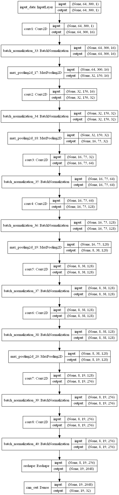
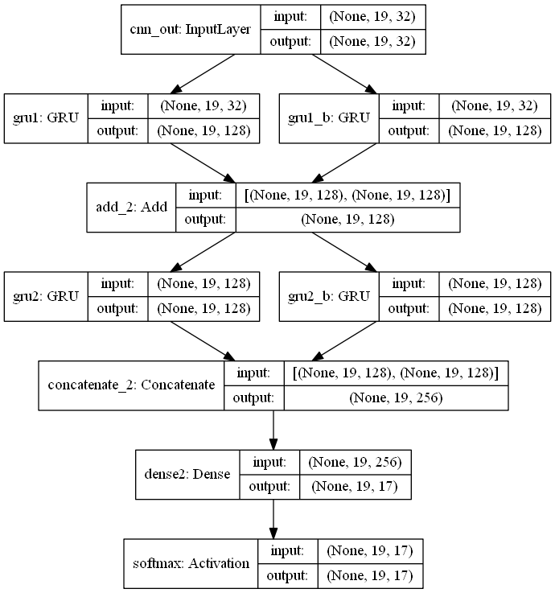
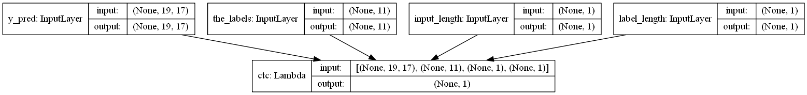
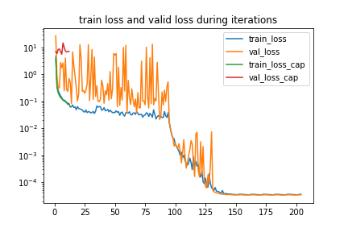
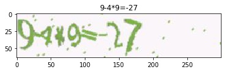
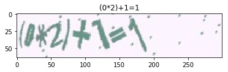
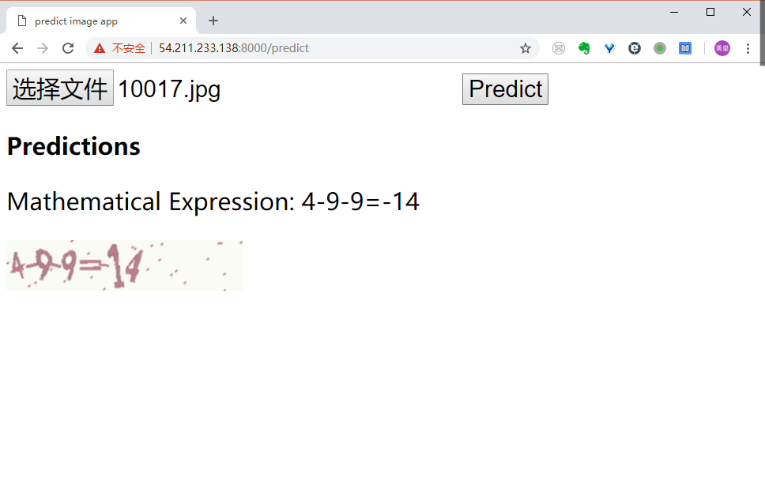

# 算式识别项目 - 机器学习工程师毕业项目

## 介绍

这是Udacity机器学习工程师的毕业项目，主要利用keras和TensorFlow，构建了一个CNN+RNN的模型
利用CTC Loss解决了准确识别图像中算式的问题，在这个项目中，得到了在给定数据集上100%
的准确率，并利用flask框架建立了一个web端的OCR服务(http:54.211.233.138:8000/predict)。整个项目的分析，建模，训练，预测，思考的代码部分在`mathexpression_recognition.ipnb`
，报告及结果呈现在'report/report.pdf'中。

## 项目基础

**基本处理计算机硬件条件**
- dell Inspiron14 5000series
- 操作系统win10(x64)
- CPU: InteL(R) Core(TM) i7-5500U CPU @2.40GHz
- memory: 8GiB

**训练用计算机硬件条件**
- 阿里云抢占式实例
- 异构计算GPU/FPGA 
- GPU计算性跟你
- ecs.gn5-c4g1.xlarge
- vCPU: 8vCPU
- memory: 30GiB
- GPU/FPGA: 1*NVIDIA P100 1*4400 GiB
- process number: Interl Xeon E5-2682v4 2.5GHz

所使用的库
- keras==2.2.4
- Flask==0.12.2
- numpy==1.13.1
- pandas==0.20.3
- Pillow==4.2.1
- scikit-learn==0.19.0
- tensorflow==1.11.0
- captcha==0.3
- opencv-python==3.1.0.3

所使用数据集[Mathematical_Expression_Recognition_train](https://s3.cn-north-1.amazonaws.com.cn/static-documents/nd009/MLND+Capstone/Mathematical_Expression_Recognition_train.zip)

**数据集介绍**
此数据集包含10万张图片，每张图里面都有一个算式。
- 可能包含 +，-，* 三种运算符
- 可能包含一对括号，也可能不包含括号
- 每个字符都可能旋转，所以 + 号可能长得像我们平时手写的 * 号，不过 * 号有六个瓣
- 

## 模型的架构
使用CNN+RNN构建的模型，利用CTC Loss进行训练，模型的架构如下，

## 模型训练时长
1epoch约为40分钟，50epoch总共30多小时。训练脚本在`train_keras.py`和
`dataset_keras.py`中，训练时标准输出信息在`train_captcha.log`和
`train2.log`中，相应代码在`mathexpression_recognition.ipnb`中都有
体现。

## 模型训练结果
达到原数据集上预测准确率为100%。
  

## 应用
利用Flask框架，部署在AWS上的网页端OCR服务(http:54.211.233.138:8000/predict)。

